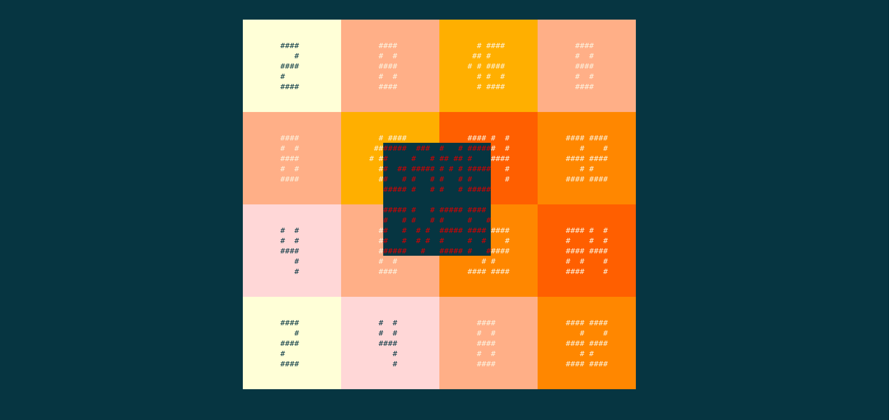
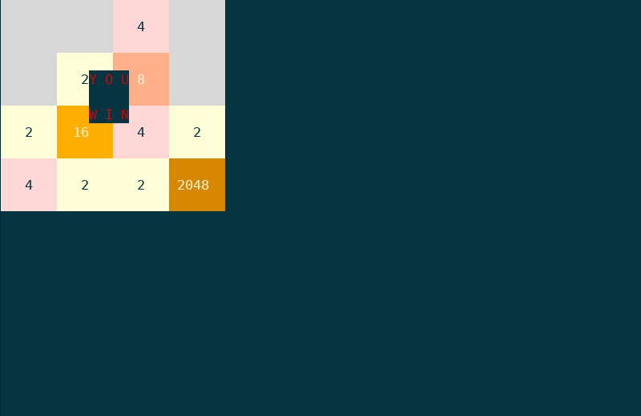

# 2048-curses
Yet another terminal-based implementation of 2048 game, written in python & ncurses.

## Screenshots

    

    

## Run
~~~ sh
$ python3 2048.py
~~~
or
~~~ sh
$ chmod +x 2048.py
$ ./2048.py
~~~

## Controls
* Movement: ← ↑ → ↓ or h j k l
* Restart: r
* Quit: q

## Requirements
* Python >= 3.6 (tested on Python 3.6.6)
* Curses module for python (should be included in the python's standard library on most Unix-like systems)
* Terminal with 256 colors support

## Configuring
Feel free to adjust settings in **config.py**.

#### Note
Your terminal's size does matter. The game is capable of running in 2 modes: Large or Small; it's Large by default.
But if your terminal is not large enough, the game tries to run in Small mode.
You can override the default behaviour by simply passing the appropriate parameter into the Game constructor:
~~~ python
...
game = Game(config.Mode.Small)
...
~~~

## License
2048-curses is licensed under the [MIT license](LICENSE).